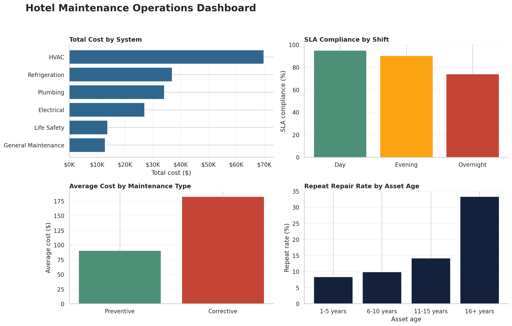

# Hotel Maintenance Operations Analytics

An end-to-end Python and SQL portfolio project that turns hotel maintenance work orders into recommendations for reducing downtime, repeat repairs, operating cost, and guest disruption.



## Why I Built This Project

My background includes U.S. Army HVAC and refrigeration work, overnight hotel engineering, and hospitality operations. I built this project to connect that hands-on experience with the analytics skills I am developing in Georgia State University's Master of Science in Analytics program.

The central business question is:

> How can hotel leadership use maintenance data to improve response performance, control costs, and protect the guest experience?

## Results at a Glance

The analysis uses **1,200 synthetic work orders** covering HVAC, plumbing, electrical, refrigeration, general maintenance, and life-safety systems.

- HVAC was the largest cost center, generating **$69,750** in maintenance cost.
- Overnight SLA compliance was **74.0%**, compared with **95.0%** during the day.
- Preventive work orders averaged **$91**, versus **$183** for corrective work orders.
- Assets 16+ years old had a **33.3% repeat-repair rate**, compared with **8.4%** for assets 1–5 years old.

These findings support targeted preventive maintenance, overnight escalation coverage, and root-cause reviews for aging repeat-failure assets. Because the data is synthetic, the results demonstrate an analytical workflow rather than describe a real employer.

## Skills Demonstrated

- Python: pandas, NumPy, Matplotlib, and Seaborn
- SQL: aggregations, conditional logic, CTEs, filtering, and KPI calculations
- Data cleaning and validation
- Exploratory data analysis
- KPI development and data visualization
- Translating technical findings into business recommendations
- Reproducible project organization and documentation

## Business Questions

1. Which building systems drive the most work orders, cost, and downtime?
2. Which engineering shift has the greatest SLA performance opportunity?
3. How do preventive and corrective work orders compare?
4. Does repeat-repair risk change as assets age?
5. Which issue categories create the greatest guest impact?

## Project Structure

```text
hotel-maintenance-analytics/
├── data/
│   ├── hotel_maintenance_work_orders.csv
│   └── hotel_maintenance.db
├── notebooks/
│   └── Hotel_Maintenance_Analysis.ipynb
├── reports/
│   ├── figures/
│   ├── executive_summary.md
│   └── analysis output tables
├── sql/
│   └── maintenance_analysis.sql
├── src/
│   ├── analyze_maintenance.py
│   ├── build_database.py
│   └── generate_data.py
├── tests/
│   └── test_project.py
├── requirements.txt
└── run_project.py
```

## How to Run the Project

### 1. Clone the repository and enter the folder

```bash
git clone https://github.com/mjcuffee-commits/hotel-maintenance-analytics.git
cd hotel-maintenance-analytics
```

### 2. Create a virtual environment

```bash
python -m venv .venv
```

Activate it on Windows:

```bash
.venv\Scripts\activate
```

Activate it on macOS or Linux:

```bash
source .venv/bin/activate
```

### 3. Install the packages

```bash
pip install -r requirements.txt
```

### 4. Reproduce every output

```bash
python run_project.py
```

You can also open `notebooks/Hotel_Maintenance_Analysis.ipynb` in Jupyter or VS Code and run the cells from top to bottom.

## Dataset

The dataset is generated with a fixed random seed, so the project is fully reproducible. It contains no employer, guest, or personally identifiable information.

| Column | Meaning |
| --- | --- |
| `work_order_id` | Unique work-order identifier |
| `opened_at`, `closed_at` | Request and completion timestamps |
| `property_area` | Hotel area affected |
| `system_type` | HVAC, plumbing, electrical, refrigeration, general maintenance, or life safety |
| `maintenance_type` | Preventive or corrective work |
| `priority` | Emergency, high, medium, or low |
| `shift` | Day, evening, or overnight |
| `asset_age_years` | Age of the affected asset |
| `response_minutes` | Minutes from opening to engineering response |
| `downtime_hours` | Total time from opening through repair completion |
| `total_cost` | Parts plus estimated labor cost |
| `sla_met` | Whether response time met the priority target |
| `repeat_within_30_days` | Whether the issue repeated within 30 days |
| `guest_impact` | Whether the work order affected a guest-facing service |

## Main Recommendations

- Focus HVAC and refrigeration preventive-maintenance reviews on high-cost assets more than 10 years old.
- Test flexible overnight coverage for high-priority calls and measure the change in SLA compliance.
- Require a root-cause review after a repeat repair within 30 days.
- Build a monthly management scorecard for SLA compliance, response time, repeat rate, downtime, and cost by system.

## Important Limitation

This project identifies associations, not causal effects. For example, preventive work orders cost less on average in the synthetic data, but a controlled before-and-after study would be needed to estimate the savings caused by a new preventive-maintenance program.

## Author

**Melvin “Joseph” Cuffee**  
M.S. Analytics Student | Hospitality Operations | U.S. Army Veteran
